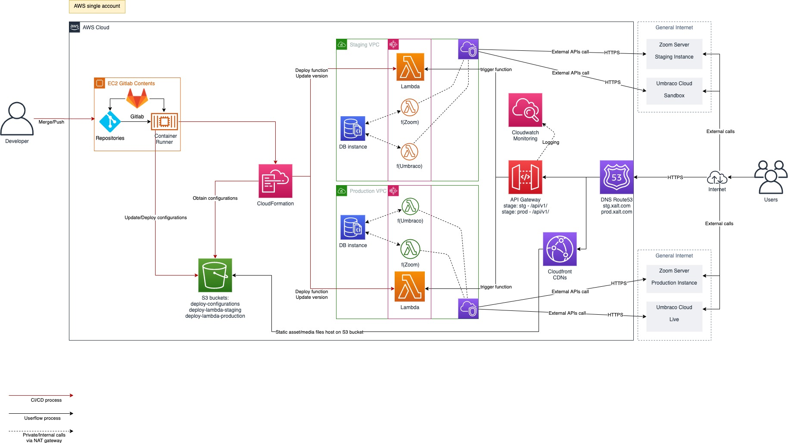

# INTRODUCTION

For answering the questions test.

## Why Serverless?

- Costs saving
- Handle scaling, flexibility
- In order to focus on business logic and application code

## Platformm of choices

- I would pick Amazon Web Service (AWS) as the platform of choice

### Why AWS Lambda

- Tools like provisioned concurrency and AWS SAM provide a layer of configuration and complexity management that greatly eases the challenge of working with a serverless application, at no additional cost.
- And, is my favorite platform
- SAM (Serverless Application Model) templates and Lambda Layers to support deploy and write code in serverless framework

# Architecture overview

# CI/CD pipelines

Actually, I was considering between Github Actions and Gitlab CI for the CI/CD pipelines, and Gitlab would be my choice as I think Gitlab is more mature than and I get more familiar with Gitlab CI.

# IaC tools/libraries

Terraform - because of its simple - clean syntax and a lot of supported built-in modules, especially aws-modules

- Terraform AWS modules
- Terraform backend as S3 storage to store the state file
- Terragrunt to help to excute multiple environments, multiple aws account, multiple modules at once

# Monitoring tools

- [X] AWS CloudWatch
- [ ] NewRelic
- [ ] DataDog

While NewRelic and Datadog is costly (Datadog is the most expensive in my opinion), it seems like CloudWatch is the good fit because we are using AWS platform as elaborate above.

The benefits:
If we use AWS platform then CloudWatch would be the best choice, because of its providing most reliable, scalable and flexible way to monitor our resource or application on cloud.
Cloudwatch is supporting 2 monitoring modes: basic and detailed monitoring.
We can also manage resource utilization of your servers.
Besides that:

- Custom our own metrics monitoring way
- Make use of alarm on resources ultilization
- It has supported to stream the logs to other platforms (ex Datadog) via an agency
- Integrated with other AWS services easily
