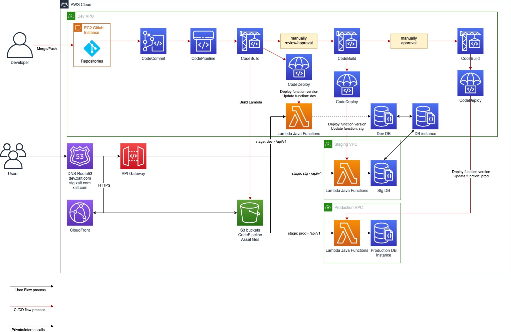

# Run Book / Operations Manual

**Table of Contents**

**[System Overview](#system-overview)**

- [Run Book / Operations Manual](#run-book--operations-manual)
- [System overview](#system-overview)
	- [Contributing applications, daemons and proposed-services](#contributing-applications-daemons-and-proposed-services)
	- [Architecture design:](#architecture-design)
	- [Resilience, Fault Tolerance and High-Availability](#resilience-fault-tolerance-and-high-availability)
		- [Database clustered (RDS)](#database-clustered-rds)
	- [Throttling and Partial Shutdown](#throttling-and-partial-shutdown)
	- [Required resources](#required-resources)
	- [Expected Traffic and Load](#expected-traffic-and-load)
		- [Hot or Peak Periods](#hot-or-peak-periods)
		- [Warm Periods](#warm-periods)
		- [Cool or Quiet Periods](#cool-or-quiet-periods)
	- [Environmental Differences](#environmental-differences)
	- [Tools and Libraries](#tools-and-libraries)
- [Security and Access Control](#security-and-access-control)
- [System Configuration Management](#system-configuration-management)
- [Monitoring and Alerting](#monitoring-and-alerting)
	- [CloudWatch](#cloudwatch)
	- [CloudWatch Alarm](#cloudwatch-alarm)
			- [Alarm States](#alarm-states)
	- [SNS, SES Composing](#sns-ses-composing)
- [Operational Tasks](#operational-tasks)
	- [Deployments](#deployments)
	- [Routine Checks](#routine-checks)
	- [Troubleshooting](#troubleshooting)
- [Maintenance Tasks](#maintenance-tasks)
	- [Maintenance Procedures](#maintenance-procedures)
			- [Patching](#patching)
			- [Technical Testing](#technical-testing)
			- [Post-Deployment](#post-deployment)
- [Failure and Recovery Procedures troubleshooting](#failure-and-recovery-procedures-troubleshooting)
	- [Failover](#failover)
	- [Recovery](#recovery)
- [Contact Details](#contact-details)

**[Security and Access Control](#security-and-access-control)**

**[System Configuration Management](#system-configuration-management)**

**[Monitoring and Alerting](#monitoring-and-alerting)**

- [CloudWatch](#cloudwatch)
- [CloudWatch Alarm](#cloudwatch-alarm)
- [SNS, SES Composing](#sns-ses-composing)

**[Operational Tasks](#operational-tasks)**

- [Deployments](#deployments)
- [Routine Checks](#routine-checks)
- [Troubleshooting](#troubleshooting)

**[Maintenance Tasks](#maintenance-tasks)**

- [Maintenance Procedures](#maintenance-procedures)
  - [Patching](#patching)
    - Normal Cycle
    - Zero-Day Vulnerabilities
  - GMT/BST time changes
  - Cleardown Activities
  - Log Rotation
  - [Technical Testing](#technical-testing)
  - [Post-Deployment](#post-deployment)

**[Failure and Recovery Procedures troubleshooting](#failure-and-recovery-procedures-troubleshooting)**

- [Failover](#failover)
- [Recovery](#recovery)

**[Contact Details](#contact-details)**

This runbook assumes that we are using Amazon Web Services (AWS) as our platform of choice.

# System overview

Company "Xalt" applying serverless archiecture in their system design with CI/CD integration.

AWS Lambda will be used as a backbone system for executing the business flow.

## Contributing applications, daemons and proposed-services

Xalt is considering to support these subjects:

- Zoom server: assuming we are making use of streaming/live video on zoom's server, we are only to integrating user/room meeting registration via their public (rest) APIs
- Web server: can be SPA web application with 2 area: client code (frontend) and server based (backend)
- Database server (SQL): then it can be some RDS cluster/instance, for i.e PostgresSQL RDS instance
- Network file share, shared between Zoom server & Web for media storage: S3 as a central place for storing file and media storage because of its great supportively and global
- Content Delivery Network (CDN) - Only the web server is behind it: CloudFront can be a solution for this case.

## Architecture design:

## Resilience, Fault Tolerance and High-Availability

As we are using AWS platform, according to their **serverless for high availability**: https://docs.aws.amazon.com/whitepapers/latest/fault-tolerant-components/using-serverless-architectures-for-high-availability.html

> Serverless provides built-in availability and fault tolerance. You don't need to architect for these capabilities since the services running the application provide them by default.

> Central to many serverless designs is AWS Lambda. AWS Lambda automatically runs your code on highly available, fault-tolerant infrastructure spread across multiple Availability Zones in a single region without requiring you to provision or manage servers

### Database clustered (RDS)

Following the high availability principle, we can use AWS RDS multiple-AZ deployments.
In case of an infrastructure failure, AWS RDS performs an automatic failover to the standby DB instance. Since the endpoint for your DB instance remains the same after a failover, the application can resume database operation without the need for manual administrative intervention.

Example for our serverless architecture with AWS RDS multiple availability zones:

## Throttling and Partial Shutdown

When you invoke a function, two types of error can occur. Invocation errors occur when the invocation request is rejected before your function receives it.

Function errors occur when our function's code or runtime returns an error. Depending on the type of error, the type of invocation, and the client or service that invokes the function, **the retry behavior and the strategy for managing errors varies.**

## Required resources

AWS Lambda can be directly triggered by AWS services such as S3, DynamoDB, Kinesis, SNS, and CloudWatch. It can be fire up from the scheduler event (Lambda Scheduler).

Any kind of event like HTTP request to API Gateway can also trigger the Lambda functions.

## Expected Traffic and Load

### Hot or Peak Periods

### Warm Periods

### Cool or Quiet Periods

- From the first time execution

## Environmental Differences

AWS Lambda functions can be grouped by 2 mains environment area: staging (aka `stg`) and production (`prod`)

Besides that we might also need to have the development `dev` environment for sample, experimental deployment and test.

## Tools and Libraries

- AWS SAM
- AWS SAM CLI
- AWS CLI
- AWS SDK
- Docker CLI
- CloudFormation

# Security and Access Control

AWS IAM roles and policies need to be setup in order to provision AWS Lambda and other related-services resource.

Sample Lambda execution roles:

- AWSLambdaBasicExecutionRole: Permission to upload logs to CloudWatch.
- AWSLambdaDynamoDBExecutionRole: Permission to read events from an Amazon Kinesis data stream or consumer.
- CloudWatchLambdaInsightsExecutionRolePolicy: Permission to write runtime metrics to CloudWatch Lambda Insights.

# System Configuration Management

The central configuration (or configuration manager) could be made to store the detailed of deployments for different environments through CI/CD workflow.

IAM role: Read/Write to S3 bucket need to be attach.

There are 2 ways can be considered:

- S3 storage with encrypted and versioning buckets
- More secure, AWS Secret Manager to store sensitive information

Overwrite/Apply new configuration: CI/CD deploy new version and build serverless code.

Read configurations/parameters: when executing Lambda functions and require environment variables.

# Monitoring and Alerting

## CloudWatch

In order to do the system health check and what kinds of messages/events returns in the logging.

## CloudWatch Alarm

#### Alarm States

A metric alarm has the following possible states:

- **OK** – The metric or expression is within the defined threshold.
- **ALARM** – The metric or expression is outside of the defined threshold.
- **INSUFFICIENT_DATA** – The alarm has just started, the metric is not available, or not enough data is available for the metric to determine the alarm state.

## SNS, SES Composing

From those states, one solution is to setup a SNS topic and send out the notification email via SES to the ops team.

# Operational Tasks

## Deployments

There are 2 options of choices:

- Gitlab CI/CD pipeline integration workflow.

  
- Make use of AWSCodeCommit, AWSCodePipeline, AWSCodeBuild and AWSCodeDeploy workflow on. Example for combining with **multiple-VPCs**:

  

  The similiar architecture with **multi AWS accounts**, this is recommend to have a different Amazon Account for production environment.

## Routine Checks

- System health
- System rebuilds if there are some issues or interupted resource/data.

## Troubleshooting

- Not able to deploy AWS Lambda
- Deployed AWS Lambda is not able to run
- The cold start took too long to run
- SAM CLI to deploy package

# Maintenance Tasks

## Maintenance Procedures

#### Patching

Discover and fix the lambda function, database server, third-party APIs call integration asap. Test first: patching to dev/stg environment first to verify the issue.

- Normal Cycle
- Zero-Day Vulnerabilities
  - GMT/BST time changes
  - Cleardown Activities
    - Log Rotation

#### Technical Testing

#### Post-Deployment

Cleanup redundant resources consuming.

# Failure and Recovery Procedures troubleshooting

Reliability best practices on using AWS Lambda

## Failover

- Multiple regions, mutiple availability zones architecture designs. For example, multi-regions:

  

## Recovery

- Make sure no function invocations are lost during the outage period.
- Make sure all received events are processed after your function has recovered. Considering to use `dead letter queues` to process events placed on that queue after recovery occurs.

# Contact Details

- IT support team
- Devops team
- Manager

*Note*: This run book is inherited from the following runbook template: https://github.com/SkeltonThatcher/run-book-template/blob/master/run-book-template.md
